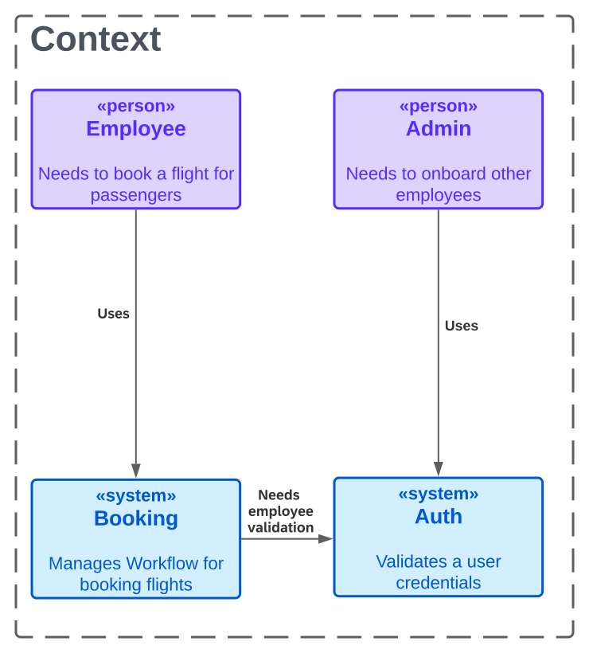
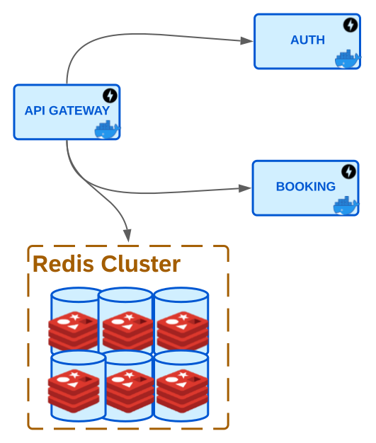

# Fast Gateway

A FastAPI API Gateway proof of concept.

This POC is a simple API Gateway that uses FastAPI to route requests to different services.
It is meant to be used as a starting point for a more complex API Gateway.

**NOTE**: User service is only a crud service, it does not have any authentication or authorization.

## Features

- API Gateway
- User service
- Booking Service
- Rate limiter

## Context

This simple project allows creating users and booking flights for those users.

Employees of an airline company can book flights for passengers.
For that they need to be previously onboarded in the system.

## Architecture

Consists of 2 services, an API Gateway and a Redis cluster.

They are all dockerized and can be run with docker-compose.

## Design

The API Gateway is a microservice architecture pattern that provides a single entry point for all clients to access
backend services. It acts as an intermediary between clients and backend services, handling requests and responses,
and providing additional features such as authentication, rate limiting, and caching.

### API Gateway

Our API Gateway is built with FastAPI, a modern web framework for building APIs with Python.
We chose FastAPI for its high performance, ease of use, and excellent documentation.

To run FastAPI in production, we are using gunicorn, a popular Python WSGI HTTP server, with uvicorn,
a lightning-fast ASGI server, as the worker class.
This combination provides us with high concurrency, low latency, and efficient memory usage.

The API Gateway currently routes requests to two backend services, `Auth` and `Booking`.
Both services are built with FastAPI and are designed to be simple, single-file services that demonstrate how
our API Gateway can be used to route requests to multiple services. They are NOT production ready.

It was developed following the principles of Clean Architecture and ideas from the Cosmic Python book,
which emphasizes the importance of designing systems that are maintainable, testable, and scalable.

The Clean Architecture emphasizes separation of concerns and independence of implementation details
from the business logic. In this architecture, the application is divided into
different layers: the domain layer, which contains the business logic and domain objects,
the application layer, which handles use cases, and the infrastructure layer, which provides implementations
for the details such as database access and network communication.

In addition to this, we have implemented CQRS (Command Query Responsibility Segregation),
which is a design pattern that separates read and write operations into separate models,
and Dependency Injection, which is a technique that allows us to inject dependencies into
classes instead of hard-coding them.

The project structure recommendations from the Cosmic Python book have also been followed.
This includes organizing code into packages that reflect the different layers of the application and using
standard naming conventions for modules and classes.

### Rate Limiter

We are using the Redis cluster to implement a distributed rate limiter for our API.
This is necessary because when running a large-scale production system, we need to ensure that a single client or
user doesn't monopolize the system's resources. Rate limiting helps ensure that resources are fairly allocated
and distributed among all clients and users.

By using a Redis cluster, we can distribute the rate limiting across multiple nodes, making the rate limiting
more scalable and fault-tolerant. This means that even if one or more nodes in the cluster fail, the rate limiting
mechanism can continue to function correctly.

In this implementation, a Redis key is used to represent a token bucket.
Each time a request is made, the value of the key is incremented by one, representing the addition of a token
to the bucket. The expiration time of the key is set to the duration of a fixed time interval, representing
the time window during which tokens are added to the bucket.

If the value of the key exceeds a predetermined threshold, it means that the token bucket is full and no more tokens
can be added. This operation is ensured by the `INCR` command, which atomically increments the value of the key,
with this it is guaranteed that no two clients/users can increment the value of the key at the same time.

We then set an expiration time on this counter using the `EXPIRE` command, so that it automatically resets after a
set period of time. If a client/user exceeds their allotted rate limit, the API returns a `429 Too Many Requests`
response.

This approach is similar to the token bucket algorithm, where tokens are added to a bucket at a fixed rate and
requests are served only if there are enough tokens in the bucket.

## Recommended Readings

- [FastAPI](https://fastapi.tiangolo.com/)
- [Uvicorn](https://www.uvicorn.org/)
- [Pydantic](https://pydantic-docs.helpmanual.io/)
- [Gunicorn](https://gunicorn.org/)
- [Docker](https://www.docker.com/)
- [Docker Compose](https://docs.docker.com/compose/)
- [Redis](https://redis.io/)
- [Designing a Rate-Limiter](https://towardsdatascience.com/designing-a-rate-limiter-6351bd8762c6)
- [Cosmic Python](https://www.cosmicpython.com/)